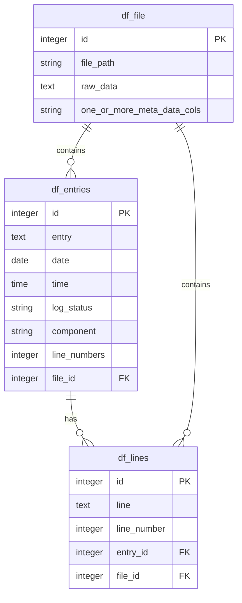

# Data Structure Notes

This file represents rough notation on how data is stored/represented internally

The structure described here is what results after a file is first read into memory
as a log or stack-trace, and then into each of its (multi-line) chunks, and then link

## Data Flow

This tool operates exactly like grep, except instead of regex, we're using good ol'
fashion SQL to find it.

A file is broken into the following tables, which themselves are represented in-memory
as Pandas DataFrames: Entries, Lines, Files, Sessions.

Via the sawmill CLI, a user will feed a file, along with a SQL script or string command, which will then return a new
DataFrame that has only those rows that match the SQL query. SQL fed into the CLI
utility will be pasted on into duckdb, which queries/joins the tables and produces the
final result, as defined by the user-provided SQL command.

<!-- TODO: come back and fix the flow diagram below -->

## Entity-Relationship Diagram

### Schema Deep-dive

1. **Entries**: each one is a raw, often multiline complex string that represents one log message
    - has a unique primary key (pk)
    - has one complex string that contains single log entry
    - has a foriegn key reference (fk) to the file from which it was extracted
2. **Lines**: each one is a string that represents one raw line in the unstructured line in a given file
    - has a pk
    - has fk to the entry in which they belong
    - has fk to the file in which they belong
3. **Files**: each one is an item storing unstructured logging/stack trace data as a complex, (heavily nested) multiline string
    - has a pk
    - has a file_path
    - has raw_data (complex string)
    - has meta_data about the file and the session it may represent (data in the file not belonging to any one entry or line, but shared across them)
4. **Sessions**: each one represents a user's attempt to run a command against an unstructured log file
    - has fk's for each file that was read
    - has a timestamp for when that file was read into the app
    - has a binary column for if the command ran successfully

Rules for relationships between tables
- There can be one or many entries in a file
- There can be one or many lines in an entry
- A file can have both have many entries and lines
- Files are currently not directly interrelated, but this may change in the future
