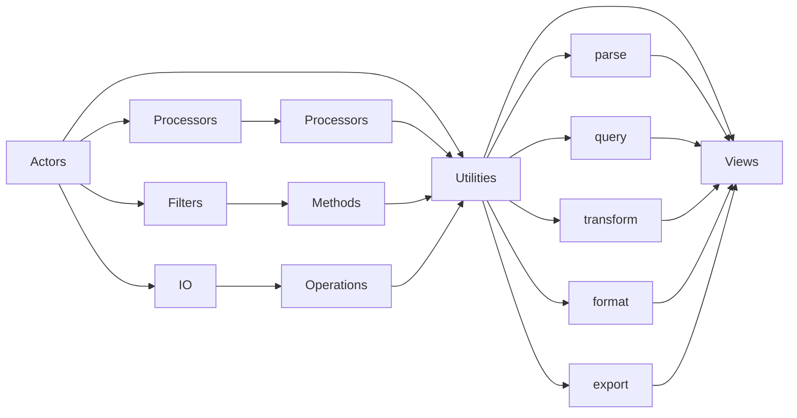

<<<<<<< HEAD
# How It Works
=======
# How it Works

## Preface

This provides a rough idea behind the structure and design of the application, both for [contributors](../CONTRIBUTING.md) and power users, as well as those who are just curious 😉.

For a better overall idea of this tool and it's project goals, review the [Introduction and Features](../README.md#introduction). 

## Concepts

At a high level, there are three levels of abstraction. From the lowest to the highest: 

    Actors > Utilities > Views

Also see the [flow diagram](#logic-and-execution-flow-diagram), for a more in-depth look at the execution flow and component dependencies.

### Logic and Execution Flow diagram 



### Actors

For our purposes, actors _are single [CRUD](https://en.wikipedia.org/wiki/Create,_read,_update_and_delete) functions or processes done directly to data, or where data is stored_. 

These are the catagories of actions that can be defined:

 #### Change, Update, or Delete

Both Processing and Filtering collective represent actions that change, update, or delete data.

- [**Processors**](#processing) and its individual **processors** focus on changes and updates to the data, especially if additional calculations are required or newly generated data must be derived from existing datasets, such as:
    - Turn json data to CSV format
    - Combining two separate datasets
    - Creating a new row in a Pandas dataframe by adding values of from existing columns
- [**Filtering**](#filtering), focus on either removing data, such that we can isolate subsets of the larger datasets for further processing, such as:
    - JSON data based on specific subkey(s)
    - Grabbing a specific piece of data from a index in a list
    - Using a SQL statement to pull specific columns and rows
- [**IO**](#io)'s focus is to read and write data from a _source_, such as: 
    - a file
    - an API endpoint on the web
    - output from another utility in the terminal 


Each action breaks down further by the data's **_format_** (what kind of data is it?) and the **_source_** (where can it find this data?)

Examples of **_format_**: 

- Python dictionary
- JSON blob
- YAML
- XML
- Text
- SQL

Examples of **_source_**:

- Text File, Parquet File, CSV, etc
- An API endpoint
- A SQL database
- stdout, stderr in the terminal

Each of these actions may be bundle together into objects based on format, source, or both.

#### Putting Everything Together

(Using pseudo-code) Let's say we want to pull out the data at every instance of the "address" key in the json blob, stored in a file, then also calculate the distance of each address from where we live, and print both the addresses and the distances to our terminal:

Overall: 

```bash
actors.io.file.read(format="json") | \ | \
actors.processors.insert_distance_from_my_house(
    on_key="distance", my_address="564 Ave NW, Washington, DC"
    ) | \
actors.io.terminal.write()
```

1. `actors.io.file.read(format="json")` 
* a. the `file.read()` IO actor opens the file
* b. this function itself calls another IO actor, `json.read()` to the open file any valid json-formatted data from the file into memory and Python
* notice because we are now piping between stdout and stdin, and the functions default to this behavior, we no longer need to explicitly describe the source

2. `actors.processors.insert_distance_from_my_house(on_key="address", my_address="564 Ave NW, Washington, DC", into_key="distance")` 
* This processor implies a few smaller processors preconfigured within:
    - an IO actor reads stdout from #1 is read in
    - another processor calculates each "address" key value and injects that value back into the larger import json blob at a new "distance" key, for each new distance calculated
    - again, by default, the updated json blob is now passed to stdout for the next actor

3. `actors.io.terminal.write()`
* we explicitly determine where the final output should be written into, but we always assume stdout, and can change to another IO actor if a different medium is required

Actions are combined together to either make more complex actions and/or then be combined into well-defined [utilities](#utilities), which is the next layer of abstraction, and the one where the user starts to interact directly with sawmill.

### Utilities

Utilities are the lower-level tools that we as users can plug into together with custom parameters to create precise pipelines and processed data. 

Utilities are combinations of [actors](#actors) with sufficient parameters that when combined with other utilities should provide inifinite reusable ability and declarative structure from which the user can create pipelines without programming.

The core utilities (in the order they should be used in a given pipeline):

1. **parse**: read and translate raw data into desired format
2. **query**: pull the desired data from the parsed data
3. **transform**: make changes to the data (Create,Update,Delete); usually the most heavily customized
3. **format**: determine columns, styling, and data format (Add metadata 'polish' for how to present the transformed information); usually the second most heavily customized
4. **export**: send the polished, formatted data to a desired destination for viewing

### Views

At some point the pipelines made between each of the core [utilities](#utilities) will likely produce results we expect in all of our different debugging sessions, so we want to abstract these pipelines into short, reusable commands that do all the work for us underneath.

Views are more fixed in the type and structure of the data, and where it is saved and presented.

>>>>>>> 03b67e5 (Adds rough notes and docs for lower-level app components)
