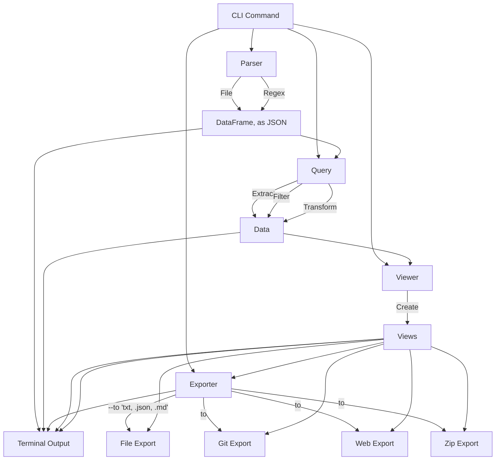

# Sawmill Application Design

The `sawmill` application is designed as a modular UNIX-styled toolbox that allows for easy parsing, querying, viewing, and exporting of data. The goal is to create smaller CLI applications that can be combined together for fully automated analysis tasks. This document outlines the structure and logic flow of the refactored `sawmill` application.

## Overview

The refactored structure includes the following main components:
- **Parsers Module:** Converts various file formats or regex-parsed data into a structured DataFrame.
- **Queries Module:** Applies extraction, filtering, and transformation to the DataFrame.
- **Viewer Module:** Determines alternative styles for the JSON data and prepares views for output.
- **Exporters Module:** Exports the processed views to various formats or displays them in the terminal.
- **Config Module:** Handles user configurations, command aliases, and macros.
- **CLI Module:** Integrates the parser, query, viewer, and exporter modules into a unified CLI tool.

## Structure and Logic Flow

(**Required order of precedence:** This defines the order in which the commands should
be used, especially if the user does not want to use all four utilities. For example, `extract` must be used before `filter`, and `filter` must be
used before `transform`.)


---

The following diagram represents the logic flow and possible combinations of the API of
the `sawmill` application:



## Components

### Parser Module
The parser module is responsible for reading various file formats and converting them into a structured DataFrame. It includes:
- **File Parser:** Converts files into a structured DataFrame.
- **Regex Parser:** Uses regex patterns to parse custom formats into a DataFrame.

### Query Module
The queries module provides methods to extract, filter, and transform the DataFrame. Queries can represent any combination of these stages, and must be used in the following order of precedence: extract > filter > transform. It includes:
- **Extract Data:** Extracts specific data from the DataFrame.
- **Filter Data:** Applies row-based filters.
- **Transform Data:** Applies various transformations to the data.

### Viewer Module
The viewer module takes JSON data and determines alternative styles for it. Multiple views can be created and referenced from the view command, and each one is outputted to stdout. It includes:
- **Create Views:** Prepares the data views for output.

### Exporter Module
The exporters module handles exporting the processed views to different formats or
displaying them in the terminal. Examples of types of outputs the exporter can handle:
- **Terminal Output:** DEFAULT - output in JSON to the terminal.
- **File Export:** Exports the views to CSV or JSON formats.
- **Git Export:** Shares the views via Git.
- **Web Export:** Shares the views via the web.
- **Zip Export:** Packages the views into a zip file.

### Config Module
The config module manages user configurations, command aliases, and macros, allowing for personalized and efficient use of the tool.

### CLI Module
The CLI module integrates all the components and provides a unified command-line interface for users to interact with the tool. Users can parse files, apply queries, create views, and export results using simple CLI commands.

## Usage Example

Below is an example of how to use the `sawmill` CLI:

The simplest example uses the defaults and pre-configured macros to avoid having to
specify all the options:

```sh
sawmill macros process </path/to/logfile.txt | https://url|rest/path/to/data>
```

The above command will attempt to parse the file or URL, extract the data, filter it,
and display it in the terminal as a formatted table.

Below is what 

```sh
export SQL="select * from log where level='ERROR'"
# there are already some aliased filters, such as for 
# log status messages, 'ERROR', 'WARN', 'INFO', 'DEBUG', 'TRACE'
export FILTER="ERROR" 
# observer the order in the command below, each filter is done in order
export EXTRA_FILTER="select * from log where message like '%error%'"

sawmill \
parse --file_path /path/to/logfile.txt \
query --extract "$SQL" --filter "$FILTER" "$EXTRA_FILTER" \ 
view --format table \
export --format structlog --as file --to /path/to/output.txt
```

This command parses the specified log file, searches for entries containing "ERROR", creates a custom view, and displays the results in the terminal.

## Conclusion

The refactored `sawmill` application provides a flexible and modular approach to parsing, querying, viewing, and exporting data. By breaking down the functionality into smaller, reusable components, the tool becomes more maintainable and extensible. Contributors and users can easily add new parsers, queries, viewers, and exporters to meet their specific needs.
